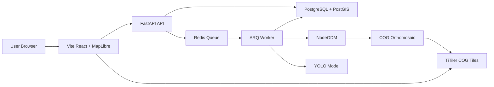

# Architecture

## Overview

Palm UAV App is a Docker Compose Web-GIS stack.

## Backend

FastAPI handles:

- Authentication
- Estate/block/mission APIs
- Imagery upload
- COG registration
- Inference job creation
- Map GeoJSON
- Analytics summaries
- Export endpoints

Worker handles:

- Orthomosaic jobs
- NodeODM polling
- YOLO inference on stitched COGs
- Georeferenced detection storage
- DBSCAN deduplication

## Database

PostgreSQL + PostGIS stores:

- Users
- Estates
- Blocks
- Missions
- Imagery assets
- Orthomosaic jobs
- Inference jobs
- Raw detections
- Deduplicated trees
- Tree observations
- Prescription maps
- Field tasks

Raw detections keep model-level boxes. Trees store deduplicated palm objects.

## Raster Flow

1. Photos are uploaded as imagery assets.
2. NodeODM stitches them into orthomosaic GeoTIFFs.
3. GeoTIFFs are registered as COG imagery assets.
4. TiTiler serves raster tiles to MapLibre.
5. Inference runs on selected stitched COGs.
6. Detection polygons are shown as MapLibre vector overlays.

## Deduplication

The worker stores all raw detections first, then DBSCAN consolidates repeated detections with a 3 metre radius.

This handles overlap between tiles and overlapping orthomosaic layers.

## Frontend

The frontend is a single React app with operational navigation:

- Home
- Missions
- Upload Imagery
- Stitching
- Map
- Prescriptions
- Reports
- Admin

Map UI is optimized for review: collapsible sidebar cards, selected COG overlays, bounding-box filters, class totals, and hover tooltips.
